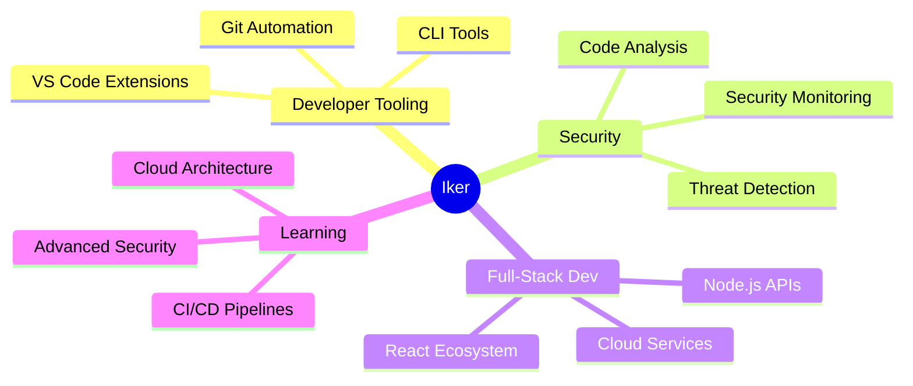

<div align="center">

<!-- HEADER ANIMADO -->


<h3>
  
</h3>

<p>
  <a href="https://portafolio-mu-flame.vercel.app/" target="_blank">
    
  </a>
  <a href="mailto:ikerdc2005@gmail.com">
    
  </a>
  <a href="https://www.linkedin.com/in/iker-domínguez-calcerrada-423736298/">
    
  </a>
  <a href="https://github.com/dominguezz05">
    
  </a>
</p>


</div>

---

## 👨‍💻 About Me

```typescript
const iker = {
  location: "📍 Madrid, Spain",
  education: " Web & Mobile Development",
  current_focus: ["🔧 Developer Tooling", "🔐 Security Engineering", "📊 Data-Driven Development"],
  philosophy: "Building tools that make developers faster and code safer",
  languages: ["Spanish 🇪🇸", "English 🇬🇧"],

  skills: {
    frontend: ["React", "Vue", "Tailwind CSS", "Vite"],
    backend: ["Node.js", "Express", "Supabase", "REST APIs"],
    mobile: ["React Native", "Android SDK"],
    devtools: ["VS Code Extensions", "CLI Tools", "Git Hooks"],
    security: ["Threat Detection", "Code Analysis", "Security Monitoring"],
    languages: ["TypeScript", "JavaScript", "Java", "Python", ]
  },

  currently_learning: ["Advanced Security Patterns", "CI/CD Automation", "Cloud Architecture"],
  hobbies: ["🎮 Game Dev", "🧩 Problem Solving", "📚 Tech Books", "⚡ Open Source"]
};
```

<div align="center">

### 🛠️ Tech Stack

<!-- LANGUAGES -->
<p>
  
</p>

<!-- FRONTEND -->
<p>
  
</p>

<!-- BACKEND & TOOLS -->
<p>
  
</p>

<!-- DEVTOOLS & MORE -->
<p>
  
</p>

</div>

---

## 🚀 Featured Projects

<div align="center">

<table>
<tr>
<td width="50%">

### ⚡ Focus Pulse
#### VS Code Extension · 2.4K+ Lines

**Gamified productivity tracker for developers**

- 🤖 AI-powered focus assistant
- 📊 Real-time analytics dashboard
- 🎮 XP system with achievements
- ☁️ Cloud sync across devices
- 🔮 Predictive fatigue detection

```
TypeScript • VS Code API • Git Integration
Published on Marketplace
```

**[📦 Marketplace](https://marketplace.visualstudio.com/items?itemName=dominguezz05.focus-pulse)** · **[⭐ GitHub](https://github.com/dominguezz05/focus-pulse)** · **[⭐ Open VSX ](https://open-vsx.org/extension/dominguezz05/focus-pulse)**

 

</td>
<td width="50%">

### 🔐 SDAS
#### Security Detection & Analysis System

**Educational cybersecurity monitoring platform**

- 🛡️ File integrity monitoring
- 🌐 Network traffic analysis
- 🔍 Suspicious process detection
- 📊 Real-time threat dashboard
- 🧪 Simulation environment

```
Java • Security Engineering • Pattern Detection
Educational Project
```

**[⭐ GitHub](https://github.com/dominguezz05/SDAS-Security-Detection-Analysis-System)**

 

</td>
</tr>

<tr>
<td width="50%">

### 🧰 DevTools Express
#### All-in-One Developer Platform

**Essential tools suite for modern developers**

- 🎨 Code formatter & beautifier
- 🔄 API testing environment
- 📝 Regex tester & builder
- 🎯 JSON/XML converter
- ⚡ Performance analyzer

```
Full-Stack • React • Node.js
Productivity Suite
```

**[🌐 Web](https://devtools-express.vercel.app/)** ·
**[⭐ GitHub](https://github.com/dominguezz05/devtools-express)**

 

</td>
<td width="50%">

### 🏭 ThreeLogics
#### Warehouse Optimization System (TFG)

**AI-powered logistics optimization platform**

- 📦 Inventory management
- 🚚 Route optimization algorithms
- 📊 Predictive analytics
- 📈 Real-time monitoring
- 🎯 Decision support system

```
Full-Stack • Optimization • Data Analysis
Final Degree Project
```

**[🌐 Web](https://threelogicsapp.vercel.app/)** ·
**[⭐ GitHub](https://github.com/threeLogics/threelogics-app)**

 

</td>
</tr>

<tr>
<td colspan="2">

### 🎮 Monkey's Paradise
#### 2D Mobile Arcade Game · Google Play

**Physics-based mobile game with AI enemies**

- 🕹️ Advanced 2D physics engine
- 🤖 Enemy AI with pathfinding
- 🎨 Custom animations & sprites
- 📱 Optimized for Android
- 🏆 Achievement system

```
Game Development • Android SDK • Physics Simulation
Published on Google Play Store
```

  

</td>
</tr>
</table>

</div>

---

## 🎯 Areas of Expertise

<div align="center">

<table>
<tr>
<td align="center" width="25%">

### 🌐 Web & Mobile Development
Building scalable, performant web applications with modern frameworks and best practices.

**React · Vue · Tailwind · Vite**

</td>
<td align="center" width="25%">

### 🔧 Developer Tooling
Creating tools that enhance developer experience and productivity.

**VS Code Extensions · CLI · Git Hooks**

</td>
<td align="center" width="25%">

### 🔐 Security Engineering
Implementing defensive security measures and threat detection systems.

**Monitoring · Analysis · Detection**

</td>
<td align="center" width="25%">

### 📊 Data & Optimization
Analyzing metrics to drive decisions and optimize processes.

**Analytics · Algorithms · Performance**

</td>
</tr>
</table>

</div>

---

## 🌱 Current Focus

<div align="center">



</div>

<table>
<tr>
<td width="33%" align="center">

### 🔨 Building
**Focus Pulse v3.0**
AI-powered developer analytics with team features

</td>
<td width="33%" align="center">

### 📚 Learning
**Advanced Security Patterns**
Deepening knowledge in defensive security & automation

</td>
<td width="33%" align="center">

### 🎯 Next Up
**Security Tools Suite**
Collection of security-focused developer tools

</td>
</tr>
</table>

---

## 💼 Professional Experience

<details>
<summary><b>🎓 Education & Background</b></summary>

<br>

**🎓 Técnico Superior en Desarrollo de Aplicaciones Web**
*Higher Degree in Web Application Development*
Focus: Frontend, Backend, Database Design, Security

**🎓 Técnico Superior en Desarrollo de Aplicaciones Multiplataforma**
*Higher Degree in Multiplatform Application Development*
Focus: Mobile Development, Cross-platform Solutions, Performance

**🏆 Final Project:** ThreeLogics - Warehouse Optimization System
*Grade: Outstanding*

</details>

<details>
<summary><b>🏆 Achievements & Highlights</b></summary>

<br>

- ⚡ Published VS Code extension with 500+ installs
- 🎮 Mobile game published on Google Play Store
- 🔐 Built educational security monitoring system
- 🧰 Created developer productivity platform
- 📊 Implemented AI-powered logistics optimization
- 🚀 Multiple full-stack projects from concept to deployment

</details>

---

## 📬 Let's Connect

<div align="center">

<table>
<tr>
<td align="center">

### 📧 Email
**ikerdc2005@gmail.com**

Best for: Project inquiries, collaborations

</td>
<td align="center">

### 💼 LinkedIn
**[Iker Domínguez](https://www.linkedin.com/in/iker-domínguez-calcerrada-423736298/)**

Best for: Professional networking

</td>
<td align="center">

### 🌐 Portfolio
**[portafolio-mu-flame.vercel.app](https://portafolio-mu-flame.vercel.app/)**

Best for: Detailed project showcases

</td>
</tr>
</table>

<br>

### 🤝 Open to Opportunities

- 💼 Full-time software engineering positions
- 🚀 Freelance/contract work on interesting projects
- 🔐 Security-focused development roles
- 🧰 Developer tooling and DX improvement projects
- 📚 Open source collaborations

<br>

**Currently based in:** Madrid, Spain 🇪🇸
**Available for:** Remote work, hybrid positions
**Languages:** Spanish (Native), English (Professional)

</div>

---

<div align="center">

### 📈 Contribution Activity


---

<div align="center">

### 💡 Random Dev Quote


</div>

---

<div align="center">


### Thanks for visiting! 🚀


</div>
